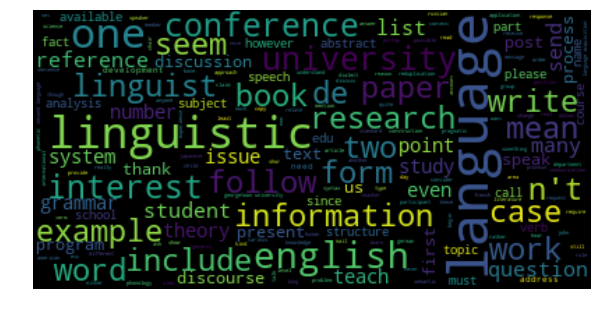

# SPAM NO_SPAM Data Analysis #

```python
import pandas as pd
import numpy as np
import matplotlib.pyplot as plt
import matplotlib as matplot
import matplotlib.image as mpimg
import seaborn as sns
%matplotlib inline
from wordcloud import WordCloud

import scattertext as st
import spacy
from IPython.display import HTML


import spacy
from gensim.models import word2vec
from scattertext import SampleCorpora, word_similarity_explorer_gensim, Word2VecFromParsedCorpus
from scattertext.CorpusFromParsedDocuments import CorpusFromParsedDocuments
```


```python
dataset = pd.read_json("dataset.json")
```


```python
dataset.head()
```


<div>
<style>
    .dataframe thead tr:only-child th {
        text-align: right;
    }

    .dataframe thead th {
        text-align: left;
    }

    .dataframe tbody tr th {
        vertical-align: top;
    }
</style>
<table border="1" class="dataframe">
  <thead>
    <tr style="text-align: right;">
      <th></th>
      <th>body</th>
      <th>label</th>
      <th>subject</th>
    </tr>
  </thead>
  <tbody>
    <tr>
      <th>0</th>
      <td>hello , offer fantastic 100 % free access most...</td>
      <td>SPAM</td>
      <td>Subject: re : free !\n</td>
    </tr>
    <tr>
      <th>1</th>
      <td>* * * * * * * * * * * * * * * * * * * * * * * ...</td>
      <td>SPAM</td>
      <td>Subject: bulk email profit\n</td>
    </tr>
    <tr>
      <th>2</th>
      <td>stock invest interest , please carefully revie...</td>
      <td>SPAM</td>
      <td>Subject: possible + 900 % stock investment ret...</td>
    </tr>
    <tr>
      <th>3</th>
      <td>syntax project innovationskolleg " formal mode...</td>
      <td>NOT_SPAM</td>
      <td>Subject: minus workshop split constituent\n</td>
    </tr>
    <tr>
      <th>4</th>
      <td>multidisciplinary periodical : call comment * ...</td>
      <td>NOT_SPAM</td>
      <td>Subject: multidisciplinary periodical : call c...</td>
    </tr>
  </tbody>
</table>
</div>


```python
dataset.shape

```


    (702, 3)


```python
dataset.isnull().any()
```


    body       False
    label      False
    subject    False
    dtype: bool


```python
fig, axs = plt.subplots(ncols=1, figsize=(12,6))
g = sns.countplot(dataset["label"])
plt.tight_layout()
plt.show();
```


```python
nlp = spacy.en.English()
corpus = st.CorpusFromPandas(dataset, category_col='label',  text_col='body',nlp=nlp).build()
```


```python
html = st.produce_scattertext_explorer(corpus, category='SPAM',category_name='SPAM',not_category_name='NOT_SPAM',width_in_pixels=1000)
open("Convention-Visualization.html", 'wb').write(html.encode('utf-8'));

#Notebook server crash while loading the html file. So render the html file into broswer and upload the snapshot
#visualization purpose only.
img = mpimg.imread('Convention-Visualization.png')
matplot.rcParams['figure.figsize'] = (30.0, 10.0)
plt.imshow(img)
plt.show()
```


```python
dataset_spam = dataset.loc[dataset.label == 'SPAM',['body']]
dataset_not_spam = dataset.loc[dataset.label == 'NOT_SPAM',['body']]
```


```python
dataset_spam.head()
```


<div>
<style>
    .dataframe thead tr:only-child th {
        text-align: right;
    }

    .dataframe thead th {
        text-align: left;
    }

    .dataframe tbody tr th {
        vertical-align: top;
    }
</style>
<table border="1" class="dataframe">
  <thead>
    <tr style="text-align: right;">
      <th></th>
      <th>body</th>
    </tr>
  </thead>
  <tbody>
    <tr>
      <th>0</th>
      <td>hello , offer fantastic 100 % free access most...</td>
    </tr>
    <tr>
      <th>1</th>
      <td>* * * * * * * * * * * * * * * * * * * * * * * ...</td>
    </tr>
    <tr>
      <th>2</th>
      <td>stock invest interest , please carefully revie...</td>
    </tr>
    <tr>
      <th>5</th>
      <td>locate anyone anywhere usa * * * * * * * old f...</td>
    </tr>
    <tr>
      <th>6</th>
      <td>hope n't object complete stranger mail , belie...</td>
    </tr>
  </tbody>
</table>
</div>


```python
dataset_not_spam.head()
```


<div>
<style>
    .dataframe thead tr:only-child th {
        text-align: right;
    }

    .dataframe thead th {
        text-align: left;
    }

    .dataframe tbody tr th {
        vertical-align: top;
    }
</style>
<table border="1" class="dataframe">
  <thead>
    <tr style="text-align: right;">
      <th></th>
      <th>body</th>
    </tr>
  </thead>
  <tbody>
    <tr>
      <th>3</th>
      <td>syntax project innovationskolleg " formal mode...</td>
    </tr>
    <tr>
      <th>4</th>
      <td>multidisciplinary periodical : call comment * ...</td>
    </tr>
    <tr>
      <th>7</th>
      <td>inform untimely death jochem schindler , prof ...</td>
    </tr>
    <tr>
      <th>9</th>
      <td>week ago , post query language moo site . rece...</td>
    </tr>
    <tr>
      <th>10</th>
      <td>cycorp seek enthusiastic , highly-motivate mul...</td>
    </tr>
  </tbody>
</table>
</div>


```python
wordcloud_spam = WordCloud(max_font_size=40).generate(' '.join(list(dataset_spam['body'])))
plt.figure()
plt.imshow(wordcloud_spam, interpolation="bilinear")
plt.axis("off")
plt.show()
```


```python
wordcloud_not_spam = WordCloud(max_font_size=40).generate(' '.join(list(dataset_not_spam['body'])))
plt.figure()
plt.imshow(wordcloud_not_spam, interpolation="bilinear")
plt.axis("off")
plt.show()
```





```python

```
